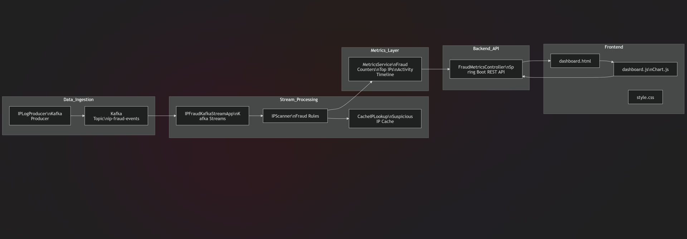

# 🚨 IP Fraud Detection System (Kafka Streams + Spring Boot)

A real-time IP fraud detection system built using Apache Kafka Streams, Spring Boot, and a live monitoring dashboard.

The system detects:

✔ Known fraudulent IPs (based on cached lookup)  
✔ Suspicious IPs (high request rate within a time window)  
✔ Real-time metrics and alerts via REST API  
✔ Interactive dashboard with charts and activity logs  

---

# 🧠 Architecture Overview


 
```text
IP_LOG.log → Kafka Producer → Kafka Topic → Kafka Streams Processor
                                           ↓
                              Fraud & Suspicious Detection
                                           ↓
                                  Output Topic + MetricsService
                                           ↓
                               Spring Boot REST API (/metrics)
                                           ↓
                                Real-time Dashboard (Chart.js)
```

---

# ⚙️ Tech Stack

## Backend

- Java 17+  
- Spring Boot  
- Apache Kafka (KRaft mode – no Zookeeper)  
- Kafka Streams  

## Frontend

- HTML5  
- CSS3 (Dark SOC-style UI)  
- Chart.js (Bar + Line charts)  
- Vanilla JavaScript (Auto refresh)  

---

# 🔍 Detection Logic

## 1️⃣ Fraud IP Detection

Uses an in-memory cache (`CacheIPLookup`) of known fraudulent first octets.

Example:

```text
212.x.x.x → FRAUD
10.x.x.x  → FRAUD
```

---

## 2️⃣ Suspicious IP Detection

Kafka Streams windowed aggregation:

```
Window: 20 seconds (tumbling)
Threshold: > 5 requests per IP in window
Marked as SUSPICIOUS
```

---

# 📊 Dashboard Features

✔ Total logs processed  
✔ Fraud count  
✔ Suspicious count  
✔ Fraud rate (%)  
✔ Top Fraud IPs (Bar chart)  
✔ Top Suspicious IPs (Bar chart)  
✔ Activity timeline (Logs processed over time)  
✔ Live alert table (Fraud & Suspicious events)  
✔ Auto refresh every 5 seconds  
✔ Scroll-safe table updates  

---

# 📂 Project Structure

```text
fraud-detection-using-kafka/
│
├── src/main/java/com/lavanya/fraudDetection
│   ├── dashboard
│   │   ├── controller
│   │   │   └── FraudMetricsController.java
│   │   │      # REST APIs for dashboard metrics
│   │   └── service
│   │       └── MetricsService.java
│   │          # In-memory metrics aggregation
│   │
│   ├── lookup
│   │   ├── CacheIPLookup.java
│   │   │   # Cached suspicious IP store
│   │   └── IPScanner.java
│   │       # Fraud IP detection logic
│   │
│   ├── producer
│   │   └── IPLogProducer.java
│   │      # Kafka producer for IP logs
│   │
│   ├── utils
│   │   └── PropertyReader.java
│   │      # Reads streaming.properties
│   │
│   ├── FraudDashboardApplication.java
│   │   # Spring Boot main class
│   └── IPFraudKafkaStreamApp.java
│       # Kafka Streams processing app
│
├── src/main/resources
│   ├── static
│   │   ├── dashboard.html
│   │   │   # Dashboard UI
│   │   ├── dashboard.js
│   │   │   # Chart.js + API calls
│   │   └── style.css
│   │       # Dashboard styling
│   │
│   └── streaming.properties
│       # Kafka Streams configuration
│
└── target/
    # Compiled artifacts
```

---

# 🛠️ Configuration

### streaming.properties

```properties
application.id=ip-fraud-detection-app
bootstrap.servers=localhost:9092
topic=ip_logs
output_topic=fraud_alerts
```

---

# ▶️ How to Run

## 1️⃣ Start Kafka (KRaft mode)

```bash
bin/kafka-storage.sh format -t <cluster-id> -c config/kraft/server.properties
bin/kafka-server-start.sh config/kraft/server.properties
```

---

## 2️⃣ Create Topics

```bash
bin/kafka-topics.sh --create --topic ip_logs --bootstrap-server localhost:9092 --partitions 1 --replication-factor 1

bin/kafka-topics.sh --create --topic fraud_alerts --bootstrap-server localhost:9092 --partitions 1 --replication-factor 1
```

---

## 3️⃣ Run Spring Boot App

From project root:

```bash
mvn spring-boot:run
```

This starts:

- Kafka Streams processor  
- Metrics REST API  
- Dashboard backend  

---

## 4️⃣ Start Kafka Producer

```bash
mvn exec:java "-Dexec.mainClass=com.lavanya.fraudDetection.producer.IPLogProducer"
```

This continuously streams logs from `IP_LOG.log` into Kafka.

---

## 5️⃣ Open Dashboard

```
http://localhost:8080/dashboard.html
```

---

# 📡 REST API

### Get Metrics

```
GET /api/fraud/metrics
```

---

# 📈 Key Highlights

-> Real-time stream processing using Kafka Streams  
-> Windowed aggregation for anomaly detection  
-> Zero database — fully in-memory metrics  
-> Clean separation of stream processing, metrics service, and UI  
-> SOC-style dark dashboard  
-> Scroll-safe live updates  
-> Optimized chart re-rendering (no flicker)  

---

# 🚀 Future Enhancements

1) Add persistent storage (Redis / PostgreSQL)  
2) Geo-location mapping of IPs  
3) WebSocket for true real-time updates (no polling)  
4) Role-based dashboard access  
5) Dockerized deployment  
6) Kubernetes scaling  

---

# 👩‍💻 Author

Lavanya  

Kafka Streams • Spring Boot • Real-time Fraud Detection

---

# 📜 License

This project is for educational and demonstration purpose
